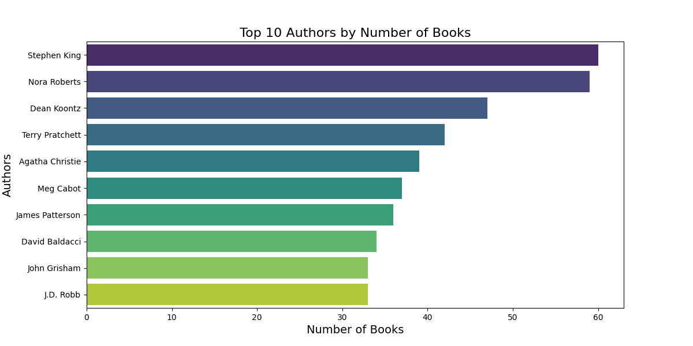
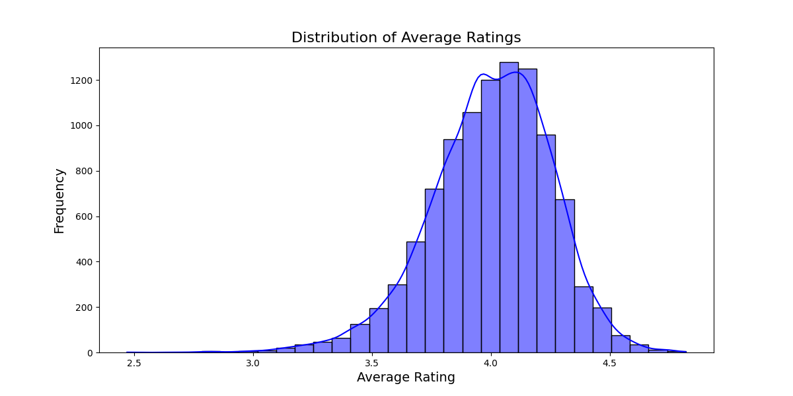
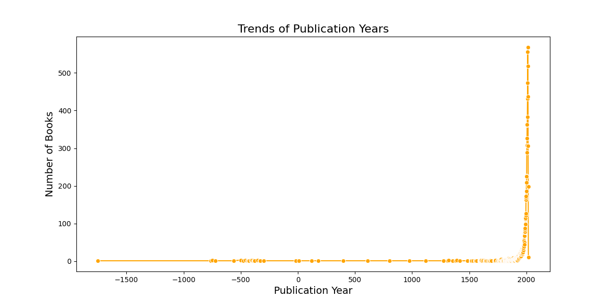

# Enhanced Story of the Goodreads Dataset

The dataset titled goodreads.csv provides a comprehensive overview of books cataloged on Goodreads, showcasing a myriad of attributes associated with each book, including authorship, publication year, ratings, and more. This dataset consists of **10,000 rows** and **23 columns**, capturing both numerical and categorical data related to books.

## Data Overview

The dataset includes essential identifiers such as book_id, goodreads_book_id, and work_id, along with attributes detailing the book's authors, publication year, title, language, and various metrics surrounding its ratings. 

### Key Insights from Descriptive Statistics

- **Numerical Features**: The average rating across all books is approximately **4.48**, with ratings ranging from 1 to 5. It is noteworthy that the maximum number of ratings for a single book is **456,191** for the lowest rating (1 star).
- **Categorical Features**: There are **9,301 unique ISBNs** and **4,664 unique authors**, indicating a vast diversity in the dataset. The most frequently recorded language is English, represented in multiple forms, such as eng, en-US, and en-GB.

### Null Values and Outliers

The dataset reveals several null values in key columns like isbn, isbn13, and original_title. Additionally, outliers were detected in various columns, with work_id exhibiting the highest percentage at **6.01%**. 

## Analysis Insights

### 1. Author Analysis

The analysis of authorship unveils the **Top 10 Authors** based on the number of books cataloged:

- **Stephen King** leads with **60** books, followed closely by **Nora Roberts** with **59**. Other notable authors include **Dean Koontz** (47), **Terry Pratchett** (42), and **Agatha Christie** (39). The presence of these prolific authors indicates a strong readership and popularity in the genre.

### 2. Ratings Distribution Analysis

The ratings distribution illustrates a significant inclination towards higher ratings with the following breakdown:

- **5 Stars**: **237,898,056** total ratings
- **4 Stars**: **199,656,966** total ratings
- **3 Stars**: **114,758,938** total ratings
- **2 Stars**: **31,108,850** total ratings
- **1 Star**: **13,450,406** total ratings

This distribution suggests a generally favorable reception of the books, with a predominant number of readers rating them positively.

### 3. Publication Year Trends

The analysis of publication years reveals a substantial volume of books published in the years **2013** (518 books) and **2014** (437 books). Interestingly, there are also historical entries with negative publication years, indicating the inclusion of classic literature or possibly erroneous data.

The trend analysis can provide insights into the evolving literary landscape and reader preferences over time.

### 4. Language Code Impact on Ratings

The impact of language on ratings showcases a fascinating trend. Books categorized under languages such as **Turkish** (average rating: **4.49**) and **Multilingual** (average rating: **4.40**) exhibit the highest average ratings. In contrast, books in **Arabic** have a lower average rating of **3.81**. This highlights the cultural and linguistic nuances influencing reader perceptions and preferences.

### 5. Outlier Analysis and Impact on Overall Ratings

The average rating across the dataset, excluding outliers, stands at **4.48**. The presence of outliers indicates that while some books receive extraordinarily high ratings, they may skew overall perceptions. Understanding the impact of these outliers is crucial for a more accurate representation of reader sentiments.

## Conclusion

The goodreads.csv dataset encapsulates a vibrant landscape of books, authors, and reader experiences. Through various analyses, we have unearthed insights into author popularity, ratings distributions, publication trends, language impacts, and the presence of outliers. These findings can inform publishers, authors, and readers alike, offering a deeper understanding of the literary ecosystem on Goodreads. 

---

*This analysis serves as a valuable resource for anyone interested in exploring the dynamics of literature and reader engagement within the Goodreads community.*

