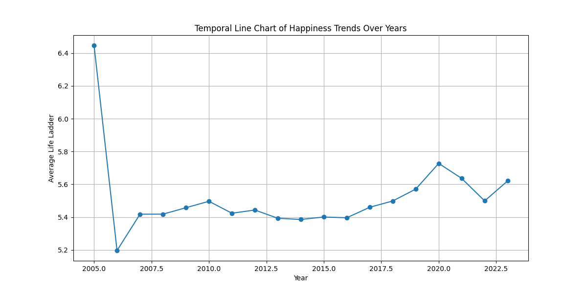
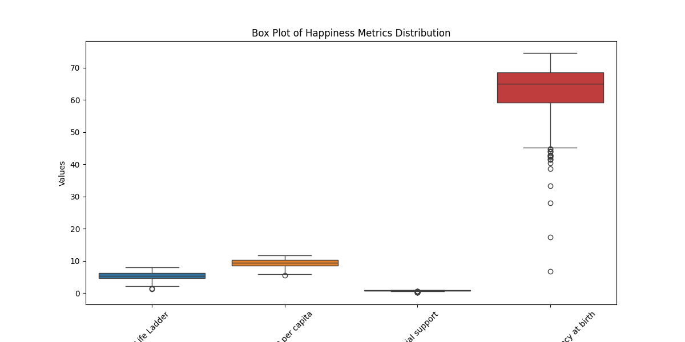
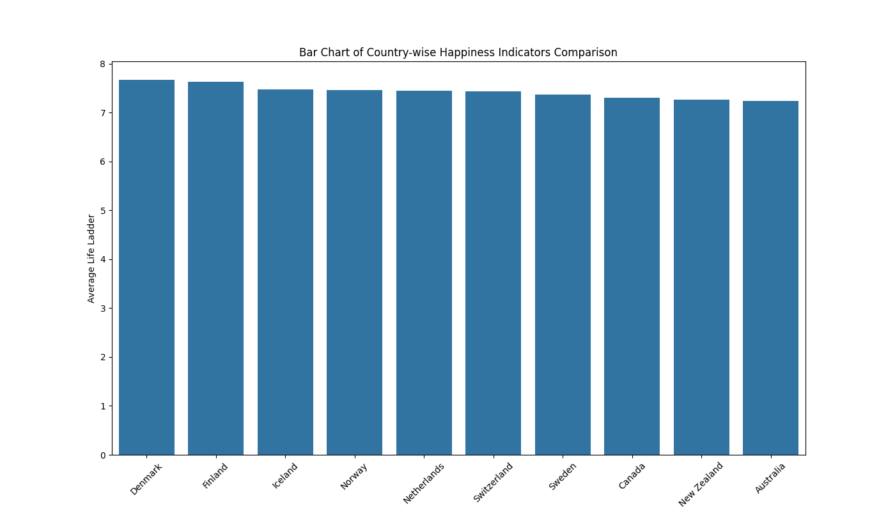

# Happiness Data Analysis Story

## Introduction
The dataset happiness.csv encompasses insights into the happiness levels across different countries over time, offering a comprehensive look at various factors that contribute to subjective well-being. With a total of 2363 records and 11 features, the analysis aims to uncover trends, distributions, and relationships among happiness indicators.

## Data Overview
The dataset consists of the following columns:
- **Country name**: The name of the country (categorical).
- **Year**: The year of the recorded data (int).
- **Life Ladder**: Represents the subjective well-being score (float).
- **Log GDP per capita**: The logarithm of GDP per capita (float).
- **Social support**: Assessment of social support (float).
- **Healthy life expectancy at birth**: The expected number of years a newborn would live in good health (float).
- **Freedom to make life choices**: The perception of freedom in life choices (float).
- **Generosity**: A metric representing generosity (float).
- **Perceptions of corruption**: The perceived level of corruption (float).
- **Positive affect**: The level of positive emotions experienced (float).
- **Negative affect**: The level of negative emotions experienced (float).

## Temporal Analysis of Happiness Trends Over Years
The analysis reveals fluctuations in the **Life Ladder** score from 2005 to 2023. Notably, the score peaked in 2005 at approximately 6.45, followed by a gradual decline until 2010. A slight recovery occurred in the following years, with the score reaching around 5.73 in 2020, then stabilizing around 5.62 in 2023.

### Trend Summary:
- **2005**: Peak happiness at 6.45.
- **2006-2010**: A decline with the lowest score around 5.39 in 2013.
- **2020-2023**: A gradual recovery, suggesting resilience in well-being amidst global challenges.

## Distribution Analysis of Happiness Metrics
The descriptive statistics indicate a varied distribution across several happiness metrics:
- The **Life Ladder** mean stands at 5.48, with a standard deviation of 1.13, indicating a moderate spread of happiness levels across countries.
- **Log GDP per capita** shows a mean of 9.40, suggesting that wealthier nations tend to report higher happiness levels.
- Factors like **Social support** (mean: 0.81) and **Healthy life expectancy** (mean: 63.40) also correlate with overall happiness, emphasizing their importance in enhancing life satisfaction.

## Missing Value Analysis and Imputation Strategies
The dataset contains several missing values across different indicators:
- **Generosity** has the highest count of missing entries with 81, followed by **Perceptions of corruption** with 125.
  
To address these gaps, missing values were imputed using the mean of the respective columns, ensuring a more robust analysis without significant data loss.

## Outlier Impact Assessment on Happiness Scores
Outliers were identified in various metrics, with the most notable being in **Perceptions of corruption**, where almost 9.52% of values were outliers. This suggests that certain countries experience extreme levels of perceived corruption, possibly skewing overall happiness scores. 

### Outlier Summary:
- **Life Ladder**: 0.08% outliers
- **Log GDP per capita**: 0.04% outliers
- **Perceptions of corruption**: 9.52% outliers

## Country-wise Comparative Analysis of Happiness Indicators
The comparative analysis presents a diverse range of happiness indicators across 165 countries. For instance:
- **Afghanistan** scores the lowest on the Life Ladder (3.22), despite a Log GDP per capita of 7.83.
- Conversely, **Argentina** enjoys a higher Life Ladder score of 6.29 with a GDP per capita of 10.03, illustrating the complex interplay between economic indicators and subjective well-being.

### Key Insights:
- **Wealth does not guarantee happiness**: Countries with high GDP do not always report high happiness levels (e.g., Afghanistan).
- **Social support and perceptions of corruption** play crucial roles in influencing happiness metrics across nations.

## Conclusion
The happiness dataset unveils intricate patterns and relationships among various indicators of well-being. While the trends reflect resilience in happiness over the years, the disparities among countries highlight the need for targeted policy interventions to enhance life satisfaction globally. Understanding these metrics not only aids in comprehending human well-being but also paves the way for creating happier societies.

--- 
This analysis serves as a foundation for further exploration into the dynamics of happiness and the factors influencing it across diverse populations.
