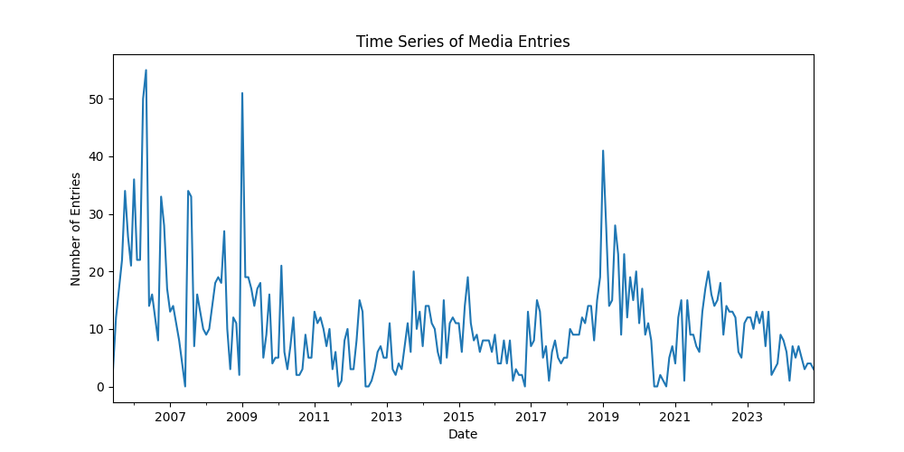
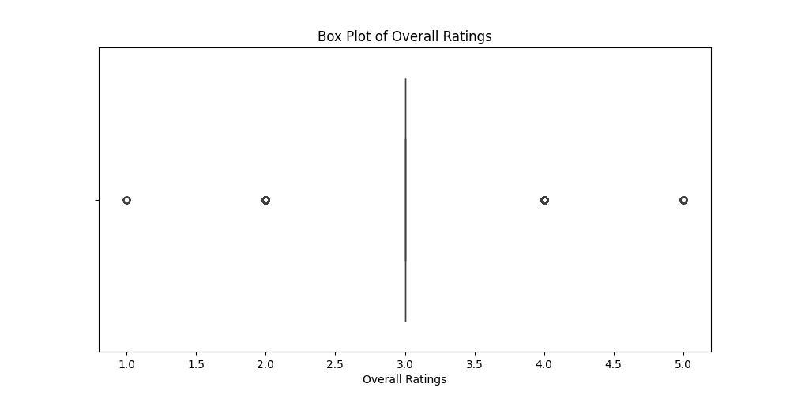
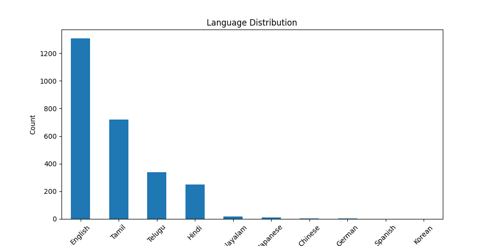

# Media Dataset Analysis Story

## Introduction

The media dataset (media.csv) consists of 2652 entries with 8 columns, capturing various aspects of media content. Each entry provides information on the publication date, language, type of media, title, author, and ratings in terms of overall quality, quality, and repeatability. This analysis will delve into the dataset to uncover trends, patterns, and insights that can inform our understanding of media consumption and production.

## Data Overview

- **Shape of the Data**: The dataset comprises 2652 rows and 8 columns.
- **Columns**:
  - date: Publication date of the media (object)
  - language: Language of the media (object)
  - type: Type of media (object)
  - title: Title of the media (object)
  - by: Author or creator (object)
  - overall: Overall rating (int64)
  - quality: Quality rating (int64)
  - repeatability: Repeatability rating (int64)

## Descriptive Statistics

### Numerical Features
- **Overall Ratings**:
  - Mean: 3.05
  - Standard Deviation: 0.76
  - Range: 1 to 5
  - 45.85% of the ratings are considered outliers.

- **Quality Ratings**:
  - Mean: 3.21
  - Standard Deviation: 0.80
  - Range: 1 to 5
  - Very few outliers were detected (0.90%).

### Categorical Features
- **Language Distribution**:
  - **English**: 1306 entries
  - **Tamil**: 718 entries
  - **Telugu**: 338 entries
  - **Hindi**: 251 entries
  - Other languages include Malayalam, Japanese, Chinese, German, Spanish, Korean, and French.

- **Type of Media**:
  - **Movies**: 2211 entries
  - **Fiction**: 196 entries
  - **TV Series**: 112 entries
  - **Non-Fiction**: 60 entries
  - **Videos**: 42 entries

### Missing Values
- **Missing Values**:
  - date: 99 missing values
  - by: 262 missing values

## Analysis Insights

### Time Series Analysis
The dataset spans a considerable period from June 18, 2005, to November 15, 2024. The mean date of entries suggests a concentration of media publications around December 2013. This could indicate a peak in media production or a change in consumption patterns around this time.

### Missing Values Analysis
The presence of missing values, especially in the by column, raises questions about data collection and completeness. This could imply either a lack of proper attribution or missing data during entry. Addressing these missing values will be crucial for further analyses.

### Outlier Analysis
The high percentage of outliers in the overall ratings suggests that there are significant variances in how media is perceived. This could stem from subjective biases in rating or a diverse range of media quality. Understanding the factors contributing to these outliers could provide deeper insights into media evaluation.

### Distribution Analysis of Numerical Features
The distribution of overall and quality ratings indicates a clustering around the mid-range values (3-4). This suggests that most media is perceived as average to good, with few exceptional cases. The repeatability rating, which has a mean of 1.49, might indicate that most media is not frequently revisited, pointing towards a transient nature of media consumption.

### Categorical Feature Analysis
The dominance of English media in the dataset reflects broader trends in global media consumption, where English content is often more accessible. The high number of movies compared to other media types indicates a strong preference or availability of films, which may suggest insights into audience preferences.

## Conclusion

The analysis of the media dataset reveals interesting trends in media consumption and production. The data highlights a significant presence of English-language movies, a concentration of media entries around a specific time period, and a tendency for average ratings across the board. Addressing missing values and understanding the outliers could further refine our understanding of media trends, ultimately guiding content creators and marketers in their strategies.

This comprehensive examination sets the groundwork for further explorations into the dynamics of media and its reception by audiences.
